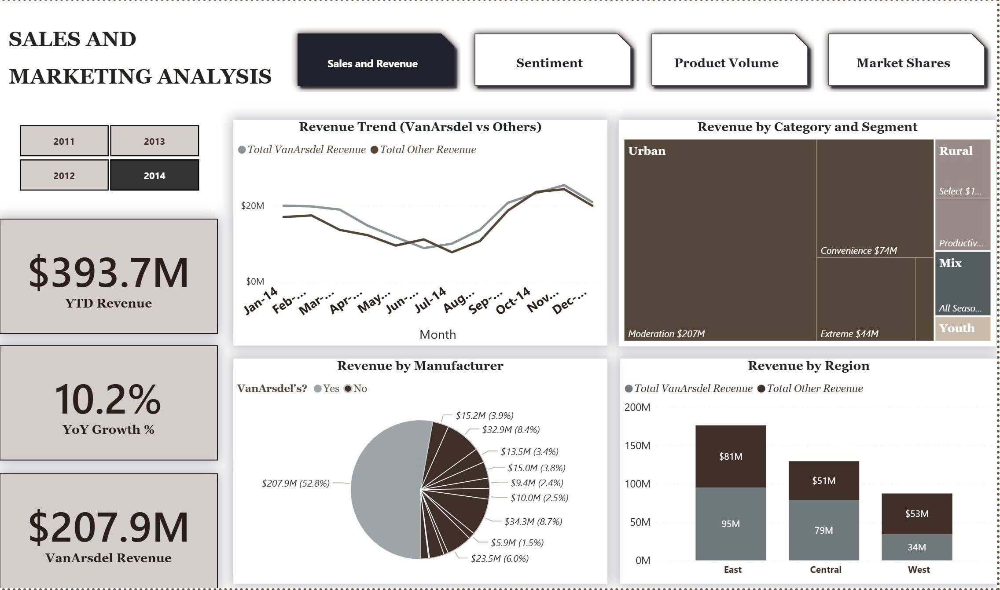

# powerbi-data-analytics-portfolio
Power BI dashboards and data analytics projects with Microsoft Sample: Sales and Marketing

## Project Objective
This project aims to build a high-level sales and marketing overview report designed for managers and decision-makers.  
The dashboard provides a clear summary of key performance metrics and trends to support quick, data-driven business decisions.

## Dashboard Preview

## Tool Used
- Power BI

## Data Analysis Process
- Data cleaning and transformation
- Data modeling
- DAX calculations
- Dashboard design and visualization

## Project Overview
The dashboard consolidates sales and marketing data into an interactive report, highlighting overall performance, trends, and key insights in a concise and easy-to-understand format suitable for managerial review.

> This project was created for learning and portfolio purposes only.
